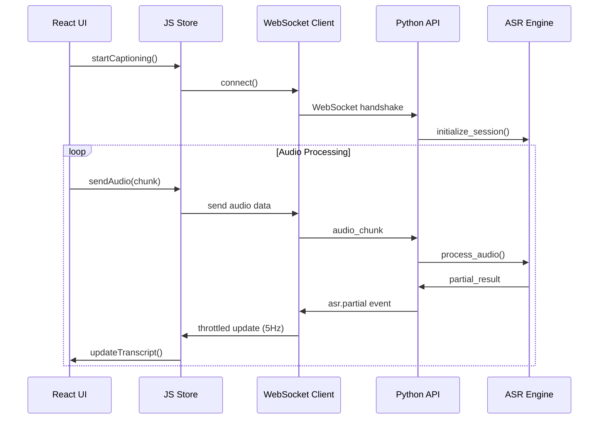

# JS-First Architecture Guide

## Overview

LoquiLex follows a **JS-first** architecture pattern where:

- **JavaScript orchestrates** - Controls workflows, state management, and user interactions
- **Python executes** - Handles ML inference, audio processing, and compute-intensive tasks  
- **Clear boundaries** - Well-defined contracts between JS and Python components

This approach provides the best of both worlds: responsive UIs with powerful ML capabilities.

## Core Principles

### 1. JS Controls the Flow

JavaScript components act as the primary orchestrators:

```typescript
// JavaScript coordinates the entire workflow
const captionSession = await createCaptionSession({
  source: 'microphone',
  language: 'en',
  translate: true
})

// JS manages state and user interactions
const handleStart = async () => {
  setStatus('starting')
  await captionSession.start()
  setStatus('active')
}
```

### 2. Python Provides Services

Python components expose services via well-defined APIs:

```python
# Python focuses on ML execution
@app.websocket("/api/ws/caption")
async def caption_websocket(websocket: WebSocket):
    session = await create_asr_session(websocket)
    await session.process_audio_stream()
```

### 3. Typed Boundaries

All communication uses strict TypeScript interfaces:

```typescript
interface CaptionRequest {
  audio_data: ArrayBuffer
  language: string
  partial: boolean
}

interface CaptionResponse {
  text: string
  confidence: number
  final: boolean
  segment_id: string
}
```

## Architecture Layers

### Frontend Layer (JavaScript/TypeScript)

**Responsibilities:**
- User interface and interactions
- Real-time state management
- WebSocket communication
- Progress tracking and throttling
- Error handling and retry logic

**Key Components:**
- React components for UI
- Zustand/Redux stores for state
- WebSocket clients with reconnection
- Worker threads for heavy computations

### Orchestration Layer (JavaScript)

**Responsibilities:**
- Workflow coordination
- Service discovery and routing
- Rate limiting and throttling (2-10 Hz)
- Background task management

**Key Components:**
```typescript
// Centralized orchestration
import { 
  createProgressWorker,
  createThrottler,
  RateLimiter,
  createWSClient 
} from '@/orchestration'

// Throttled UI updates
const throttledUpdate = createThrottler(updateProgress, { maxHz: 5 })

// Background processing
const progressWorker = createProgressWorker()
await progressWorker.computeProgress(samples, 5) // 5 Hz
```

### Service Layer (Python)

**Responsibilities:**
- ML model inference (ASR, translation)
- Audio processing pipelines
- File I/O and data persistence
- Heavy computational tasks

**Key Components:**
- FastAPI WebSocket endpoints
- Whisper ASR processing
- NLLB translation services
- Audio file handling

### Data Layer

**Responsibilities:**
- Model storage and caching
- Configuration management
- Session persistence
- Temporary file handling

## Communication Patterns

### 1. WebSocket Streaming

Primary pattern for real-time communication:

```typescript
// JS side - typed WebSocket client
const wsClient = createWSClient('ws://localhost:8000/ws/caption', {
  onMessage: (envelope: WSEnvelope<CaptionResponse>) => {
    if (envelope.t === 'asr.partial') {
      throttledUpdate(envelope.data.text)
    }
  },
  onStateChange: (state) => setConnectionState(state)
})
```

```python
# Python side - structured message handling
async def send_asr_result(websocket: WebSocket, result: ASRResult):
    envelope = WSEnvelope(
        v=1,
        t="asr.partial" if result.partial else "asr.final",
        data=result.to_dict()
    )
    await websocket.send_json(envelope.dict())
```

### 2. REST APIs

For configuration and control operations:

```typescript
// JS orchestrates via REST APIs
const config = await api.get('/api/models/config')
const session = await api.post('/api/sessions', { language: 'en' })
```

### 3. Background Workers

For heavy computations off the main thread:

```typescript
// Progress smoothing in Web Worker
const worker = new Worker(new URL('./progress.worker.ts', import.meta.url))
worker.postMessage({ type: 'COMPUTE_PROGRESS', samples, targetHz: 5 })
```

## Event Flow Example

A typical caption workflow demonstrates the JS-first pattern:



## Benefits

### 1. Separation of Concerns

- **UI/UX**: JavaScript handles all user-facing concerns
- **ML/Compute**: Python focuses on algorithmic processing
- **Integration**: Clear contracts prevent tight coupling

### 2. Performance Optimization

- **Throttling**: JS limits UI updates to 2-10 Hz for smooth rendering
- **Background Processing**: Web Workers prevent main thread blocking
- **Efficient Communication**: Structured WebSocket messages with minimal overhead

### 3. Developer Experience

- **Type Safety**: End-to-end TypeScript interfaces
- **Hot Reload**: Fast iteration on UI components
- **Clear Debugging**: Separation makes issues easier to isolate

### 4. Scalability

- **Independent Scaling**: Frontend and backend can scale separately
- **Service Architecture**: Python services can be distributed
- **Caching**: Client-side state management reduces server load

## Implementation Guidelines

### Do's ✅

- **Use typed interfaces** for all cross-boundary communication
- **Implement throttling** for high-frequency updates (2-10 Hz cap)
- **Handle disconnections** gracefully with automatic reconnection
- **Validate inputs** at both JS and Python boundaries
- **Use Web Workers** for CPU-intensive client-side tasks

### Don'ts ❌

- **Don't bypass the orchestration layer** - always go through proper channels
- **Don't exceed 10 Hz** for UI updates - causes jank
- **Don't ignore connection state** - handle all WebSocket states
- **Don't use non-null assertions** - implement proper null checking
- **Don't block the main thread** - offload heavy work to workers

## Testing Strategy

### JavaScript Layer
```typescript
// Unit tests for orchestration logic
describe('ProgressWorker', () => {
  it('should enforce 2-10 Hz frequency capping', async () => {
    const result = await worker.computeProgress(samples, 15) // Clamped to 10 Hz
    expect(result.smoothedProgress).toBeDefined()
  })
})

// Integration tests for WebSocket resilience
describe('WebSocket Resilience', () => {
  it('should handle reconnect thrash gracefully', async () => {
    // Simulate rapid connect/disconnect cycles
    // Verify bounded memory usage and stable behavior
  })
})
```

### Python Layer
```python
# Service tests with mocked JS interactions
@pytest.mark.asyncio
async def test_asr_websocket_flow():
    async with websocket_client("/ws/caption") as ws:
        await ws.send_json({"type": "audio_chunk", "data": audio_data})
        response = await ws.receive_json()
        assert response["t"] == "asr.partial"
```

## Monitoring and Observability

### Key Metrics

- **WebSocket Connection Health**: Reconnection frequency, message latency
- **UI Performance**: Frame rate, update frequency, worker utilization
- **Service Performance**: ASR processing time, translation latency
- **Resource Usage**: Memory consumption, CPU utilization, queue depths

### Logging Strategy

```typescript
// Structured logging in JS
logger.info('caption_session_started', {
  sessionId: session.id,
  language: session.language,
  clientVersion: VERSION
})
```

```python
# Correlated logging in Python
logger.info("asr_processing_started", {
    "session_id": session.id,
    "model": session.model_name,
    "audio_duration_ms": len(audio_data)
})
```

This JS-first architecture ensures LoquiLex delivers responsive, real-time captioning with the performance and capabilities users expect from modern applications.