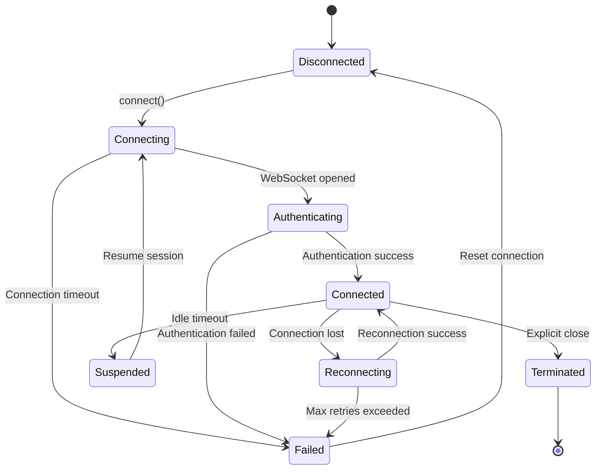

# Session Management Contract

## Overview

The Session Management API handles WebSocket connection lifecycle, session state management, and recovery mechanisms. This contract defines how JavaScript orchestrates session connections while Python manages session persistence and cleanup.

## Connection Lifecycle

### Session States
```typescript
type SessionState = 
  | 'disconnected'    // No active connection
  | 'connecting'      // WebSocket connecting
  | 'authenticating'  // Authentication in progress
  | 'connected'       // Active session established
  | 'reconnecting'    // Attempting to reconnect
  | 'suspended'       // Temporarily suspended
  | 'terminated'      // Session ended permanently
  | 'failed'          // Connection failed permanently
```

### State Transitions


## WebSocket Message Protocol

### Session Initiation

#### Client Hello
```json
{
  "v": 1,
  "t": "session.hello",
  "data": {
    "client_version": "0.1.0",
    "client_type": "web",
    "supported_features": ["asr", "mt", "downloads", "exports"],
    "resume_session_id": null,
    "last_sequence": 0,
    "client_capabilities": {
      "audio_formats": ["webm", "wav"],
      "max_audio_sample_rate": 48000,
      "ui_update_frequency": 10
    }
  }
}
```

#### Server Welcome
```json
{
  "v": 1,
  "t": "session.welcome",
  "sid": "sess_1705123456_abc123def456",
  "data": {
    "session_id": "sess_1705123456_abc123def456",
    "server_version": "0.1.0",
    "server_capabilities": {
      "max_concurrent_sessions": 10,
      "supported_languages": ["en", "zh", "es", "fr"],
      "available_models": {
        "asr": ["openai/whisper-tiny.en", "openai/whisper-small"],
        "mt": ["facebook/nllb-200-distilled-600M"]
      }
    },
    "session_config": {
      "heartbeat_interval_ms": 30000,
      "idle_timeout_ms": 3600000,
      "max_message_size": 1048576,
      "message_retention_count": 100
    },
    "replay_available": false,
    "resumed_from_sequence": 0
  }
}
```

### Heartbeat Protocol

#### Heartbeat Request
```json
{
  "v": 1,
  "t": "session.heartbeat",
  "sid": "sess_1705123456_abc123def456",
  "data": {
    "timestamp": "2024-01-13T14:30:22.150Z",
    "client_active": true,
    "last_user_interaction": "2024-01-13T14:29:45.230Z"
  }
}
```

#### Heartbeat Response
```json
{
  "v": 1,
  "t": "session.heartbeat.ack",
  "sid": "sess_1705123456_abc123def456",
  "data": {
    "timestamp": "2024-01-13T14:30:22.180Z",
    "server_time": "2024-01-13T14:30:22.175Z",
    "session_uptime_ms": 1234567,
    "server_status": "healthy"
  }
}
```

### Session Recovery

#### Resume Session Request
```json
{
  "v": 1,
  "t": "session.resume",
  "data": {
    "session_id": "sess_1705123456_abc123def456",
    "last_sequence": 145,
    "reconnect_reason": "CONNECTION_LOST",
    "client_version": "0.1.0"
  }
}
```

#### Resume Session Response
```json
{
  "v": 1,
  "t": "session.resumed",
  "sid": "sess_1705123456_abc123def456",
  "data": {
    "session_id": "sess_1705123456_abc123def456",
    "resumed": true,
    "messages_missed": 3,
    "replay_from_sequence": 143,
    "session_state": {
      "active_downloads": ["job_123", "job_456"],
      "active_exports": [],
      "current_model_asr": "openai/whisper-tiny.en",
      "current_model_mt": "facebook/nllb-200-distilled-600M"
    }
  }
}
```

### Session Termination

#### Graceful Shutdown
```json
{
  "v": 1,
  "t": "session.goodbye",
  "sid": "sess_1705123456_abc123def456",
  "data": {
    "reason": "CLIENT_SHUTDOWN",
    "message": "User closed application",
    "save_session": true
  }
}
```

#### Server Shutdown Notification
```json
{
  "v": 1,
  "t": "session.shutdown",
  "sid": "sess_1705123456_abc123def456",
  "data": {
    "reason": "SERVER_MAINTENANCE",
    "message": "Server restart scheduled in 60 seconds",
    "reconnect_after_ms": 65000,
    "session_preserved": true
  }
}
```

## REST API Endpoints

### Create Session

**POST** `/api/sessions`

Creates a new session with specified configuration.

#### Request
```typescript
interface CreateSessionReq {
  client_version: string
  preferred_languages?: string[]
  session_config?: {
    asr_model?: string
    mt_model?: string
    audio_sample_rate?: number
    idle_timeout_ms?: number
  }
  resume_session_id?: string
}
```

#### Response
```typescript
interface CreateSessionResp {
  session_id: string
  websocket_url: string
  session_token: string
  expires_at: string        // ISO8601
  config: SessionConfig
}

interface SessionConfig {
  heartbeat_interval_ms: number
  idle_timeout_ms: number
  max_message_size: number
  supported_features: string[]
}
```

### Get Session Info

**GET** `/api/sessions/{session_id}`

Retrieves current session information and statistics.

#### Response
```typescript
interface SessionInfo {
  session_id: string
  state: SessionState
  created_at: string        // ISO8601
  last_activity: string     // ISO8601
  client_info: {
    version: string
    type: string
    ip_address: string
    user_agent?: string
  }
  statistics: {
    messages_sent: number
    messages_received: number
    uptime_ms: number
    data_transferred_bytes: number
    errors_count: number
  }
  active_operations: {
    downloads: string[]     // Active download job IDs
    exports: string[]       // Active export job IDs
    asr_processing: boolean
    mt_processing: boolean
  }
}
```

### Update Session Config

**PATCH** `/api/sessions/{session_id}/config`

Updates session configuration parameters.

#### Request
```typescript
interface UpdateSessionConfig {
  asr_model?: string
  mt_model?: string
  target_language?: string
  heartbeat_interval_ms?: number
  idle_timeout_ms?: number
}
```

### Terminate Session

**DELETE** `/api/sessions/{session_id}`

Forcefully terminates a session and cleans up resources.

#### Response
```typescript
interface SessionTerminationResponse {
  session_id: string
  terminated_at: string     // ISO8601
  cleanup_completed: boolean
  resources_freed: {
    memory_mb: number
    active_downloads_cancelled: number
    temp_files_deleted: number
  }
}
```

## Error Handling

### Session Errors

#### Authentication Failed
```json
{
  "v": 1,
  "t": "session.error",
  "data": {
    "error_code": "AUTHENTICATION_FAILED",
    "error_message": "Invalid session token",
    "fatal": true,
    "retry_allowed": false
  }
}
```

#### Session Expired
```json
{
  "v": 1,
  "t": "session.error",
  "data": {
    "error_code": "SESSION_EXPIRED",
    "error_message": "Session idle timeout exceeded",
    "fatal": true,
    "retry_allowed": true,
    "create_new_session": true
  }
}
```

#### Resource Limit Exceeded
```json
{
  "v": 1,
  "t": "session.error",
  "data": {
    "error_code": "RESOURCE_LIMIT_EXCEEDED",
    "error_message": "Maximum concurrent sessions reached",
    "fatal": true,
    "retry_allowed": true,
    "retry_after_ms": 30000
  }
}
```

### Common Error Codes
- `AUTHENTICATION_FAILED` - Invalid credentials or token
- `SESSION_EXPIRED` - Session timeout or server restart
- `SESSION_NOT_FOUND` - Session ID doesn't exist
- `RESOURCE_LIMIT_EXCEEDED` - Too many concurrent sessions
- `PROTOCOL_VERSION_MISMATCH` - Client/server version incompatibility
- `INVALID_MESSAGE_FORMAT` - Malformed WebSocket message
- `RATE_LIMIT_EXCEEDED` - Too many messages per time window
- `SERVER_OVERLOADED` - Server at capacity

## Reconnection Strategy

### Exponential Backoff
```typescript
interface ReconnectionConfig {
  initial_delay_ms: 1000
  max_delay_ms: 30000
  backoff_multiplier: 2
  max_attempts: 10
  jitter_factor: 0.1
}

class ReconnectionManager {
  private attempt = 0
  private config: ReconnectionConfig
  
  calculateDelay(): number {
    const baseDelay = Math.min(
      this.config.initial_delay_ms * Math.pow(this.config.backoff_multiplier, this.attempt),
      this.config.max_delay_ms
    )
    
    // Add jitter to prevent thundering herd
    const jitter = baseDelay * this.config.jitter_factor * Math.random()
    return baseDelay + jitter
  }
  
  async reconnect(): Promise<boolean> {
    if (this.attempt >= this.config.max_attempts) {
      throw new Error('Max reconnection attempts exceeded')
    }
    
    const delay = this.calculateDelay()
    await sleep(delay)
    
    this.attempt++
    return this.attemptConnection()
  }
}
```

### Recovery Scenarios
1. **Network Interruption**: Automatic reconnection with message replay
2. **Server Restart**: Wait for server availability, resume session
3. **Browser Tab Suspension**: Detect tab focus, reconnect if needed
4. **Authentication Expiry**: Request new token, re-authenticate

## Session Persistence

### State Storage
```typescript
interface PersistedSessionState {
  session_id: string
  created_at: string
  last_sequence: number
  message_history: WSEnvelope[]
  active_operations: {
    downloads: DownloadJob[]
    exports: ExportJob[]
  }
  user_preferences: {
    asr_model: string
    mt_model: string
    target_language: string
    ui_settings: Record<string, any>
  }
  statistics: SessionStatistics
}
```

### Storage Locations
- **Client**: Browser localStorage for user preferences
- **Server**: Redis for active session state
- **Database**: PostgreSQL for session history and analytics

### Cleanup Policy
- **Active Sessions**: Persist until explicit termination
- **Idle Sessions**: Clean up after 1 hour of inactivity
- **Message History**: Keep last 100 messages per session
- **Temporary Files**: Clean up on session termination

## Performance Monitoring

### Session Metrics
```typescript
interface SessionMetrics {
  connection: {
    connect_time_ms: number
    disconnect_count: number
    reconnect_count: number
    average_reconnect_time_ms: number
  }
  
  messaging: {
    messages_per_second: number
    average_message_size_bytes: number
    message_loss_rate: number
    out_of_order_messages: number
  }
  
  latency: {
    heartbeat_rtt_ms: number
    message_processing_time_ms: number
    p95_response_time_ms: number
  }
  
  reliability: {
    uptime_percentage: number
    error_rate: number
    successful_operations: number
    failed_operations: number
  }
}
```

### Health Checks
```json
{
  "v": 1,
  "t": "session.health",
  "sid": "sess_1705123456_abc123def456",
  "data": {
    "status": "healthy",
    "uptime_ms": 1234567,
    "memory_usage_mb": 45,
    "cpu_usage_percent": 12,
    "network_latency_ms": 23,
    "message_queue_depth": 2,
    "active_operations": 3
  }
}
```

## Security Considerations

### Authentication
- **JWT Tokens**: Session tokens with expiration
- **Token Refresh**: Automatic token renewal before expiry
- **Origin Validation**: Verify WebSocket origin headers
- **Rate Limiting**: Per-session message rate limits

### Data Protection
- **Message Encryption**: TLS/WSS for all communications
- **Session Isolation**: No cross-session data access
- **Audit Logging**: Log all session creation/termination events
- **Data Retention**: Automatic cleanup of sensitive data

## Testing Contracts

### Session Lifecycle Tests
```typescript
describe('Session Management', () => {
  test('successful connection flow', async () => {
    const session = await createSession()
    expect(session.state).toBe('connected')
    
    const heartbeat = await sendHeartbeat(session)
    expect(heartbeat.type).toBe('session.heartbeat.ack')
    
    await terminateSession(session)
    expect(session.state).toBe('terminated')
  })
  
  test('reconnection with message replay', async () => {
    const session = await createSession()
    await sendMessage(session, mockASRFinal)
    
    // Simulate connection loss
    await simulateDisconnection(session)
    
    // Reconnect and verify replay
    const reconnected = await reconnectSession(session)
    expect(reconnected.data.messages_missed).toBe(0)
  })
})
```

### Error Scenario Tests
```python
@pytest.mark.asyncio
async def test_session_error_handling():
    """Test session handles various error scenarios"""
    
    # Test authentication failure
    with pytest.raises(AuthenticationError):
        await create_session(invalid_token=True)
    
    # Test session expiry
    session = await create_session()
    await simulate_idle_timeout(session)
    
    # Verify session is marked as expired
    status = await get_session_status(session.id)
    assert status.state == 'expired'
```

## Environment Configuration

### Session Variables
- `LX_SESSION_TIMEOUT_MS`: Session idle timeout (default: 3600000)
- `LX_HEARTBEAT_INTERVAL_MS`: Heartbeat frequency (default: 30000)
- `LX_MAX_SESSIONS_PER_IP`: Rate limiting (default: 5)
- `LX_SESSION_CLEANUP_INTERVAL_MS`: Cleanup frequency (default: 300000)

### Security Variables
- `LX_JWT_SECRET`: JWT signing secret
- `LX_JWT_EXPIRY_MS`: Token expiration time (default: 86400000)
- `LX_CORS_ORIGINS`: Allowed WebSocket origins
- `LX_RATE_LIMIT_PER_SESSION`: Messages per minute (default: 1000)