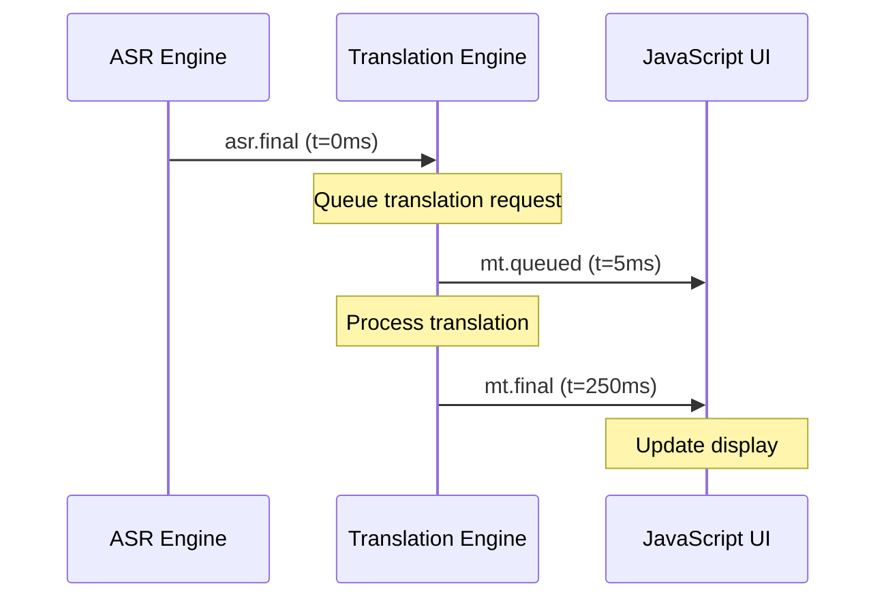

# Translation Events Contract

## Overview

The Translation Events API provides real-time translation of transcribed text via WebSocket events. Following the JS-first architecture, JavaScript orchestrates translation workflows while Python handles the machine translation processing.

## WebSocket Message Types

### Translation Events

#### Translation Final Result

Complete translation result for a transcribed segment.

```json
{
  "v": 1,
  "t": "mt.final",
  "sid": "sess_1234567890abcdef",
  "seq": 147,
  "t_wall": "2024-01-13T14:30:25.640Z", 
  "t_mono_ns": 18724567890,
  "corr": "seg_20240113_143022_001",
  "data": {
    "segment_id": "seg_20240113_143022_001",
    "source_text": "Hello, this is a complete transcription test.",
    "source_language": "en",
    "target_text": "你好，这是一个完整的转录测试。",
    "target_language": "zh",
    "confidence": 0.89,
    "processing_time_ms": 156,
    "alternatives": [
      {
        "text": "您好，这是一个完整的转录测试。",
        "confidence": 0.85
      },
      {
        "text": "你好，这是完整的转录测试。", 
        "confidence": 0.82
      }
    ],
    "metadata": {
      "model": "facebook/nllb-200-distilled-600M",
      "beam_size": 5,
      "source_detected": "en",
      "target_requested": "zh",
      "character_count": 45,
      "token_count": 12
    }
  }
}
```

#### Translation Error

Translation processing error for a segment.

```json
{
  "v": 1,
  "t": "mt.error",
  "sid": "sess_1234567890abcdef",
  "seq": 148,
  "corr": "seg_20240113_143022_002",
  "data": {
    "segment_id": "seg_20240113_143022_002",
    "source_text": "Some problematic text...",
    "source_language": "en",
    "target_language": "zh",
    "error_code": "TRANSLATION_FAILED",
    "error_message": "Text too long for translation model",
    "recoverable": true,
    "retry_after_ms": 1000,
    "fallback_available": true
  }
}
```

## Data Structure Definitions

### Translation Final Data
```typescript
interface MTFinalData {
  segment_id: string            // Links to ASR segment
  source_text: string          // Original transcribed text
  source_language: string      // Source language code
  target_text: string          // Translated text
  target_language: string      // Target language code
  confidence: number           // Translation confidence 0-1
  processing_time_ms: number   // Translation processing time
  alternatives?: TranslationAlternative[]  // Alternative translations
  metadata: MTMetadata         // Processing metadata
}

interface TranslationAlternative {
  text: string                 // Alternative translation
  confidence: number           // Confidence for this alternative
  score?: number              // Model score (optional)
}

interface MTMetadata {
  model: string               // Translation model identifier
  beam_size: number          // Beam search width used
  source_detected: string    // Actually detected source language
  target_requested: string   // Requested target language
  character_count: number    // Input character count
  token_count: number       // Token count for model
  no_repeat_ngram_size?: number  // N-gram repetition prevention
  length_penalty?: number    // Length penalty factor
}
```

### Translation Error Data
```typescript
interface MTErrorData {
  segment_id: string          // Failed segment identifier
  source_text: string        // Text that failed to translate
  source_language: string    // Source language
  target_language: string    // Target language
  error_code: MTErrorCode    // Specific error type
  error_message: string      // Human-readable error description
  recoverable: boolean       // Whether retry is possible
  retry_after_ms?: number   // Suggested retry delay
  fallback_available: boolean // Whether fallback translation exists
}

type MTErrorCode = 
  | 'MODEL_LOAD_FAILED'      // Translation model couldn't load
  | 'TRANSLATION_FAILED'     // Translation processing failed
  | 'TEXT_TOO_LONG'         // Input exceeds model limits
  | 'UNSUPPORTED_LANGUAGE'   // Language pair not supported
  | 'PROCESSING_TIMEOUT'     // Translation took too long
  | 'INSUFFICIENT_MEMORY'    // Not enough RAM for translation
  | 'INVALID_INPUT'         // Input text format issues
```

## Translation Pipeline Flow

### Sequential Processing
1. **ASR Final** → Triggers translation request
2. **Translation Processing** → Model inference in Python
3. **MT Final** → Results sent to JavaScript
4. **UI Update** → Display translated text

### Pipeline Timing


### Performance Targets
- **Translation Latency**: <300ms from ASR final to MT final
- **Maximum Latency**: <1000ms for responsive feel
- **Queue Depth**: Maximum 10 pending translations per session
- **Throughput**: Process 20+ segments per minute

## Language Support

### Supported Language Pairs

#### NLLB-200 Model Languages
```typescript
const SUPPORTED_LANGUAGES = {
  // High-resource languages
  'en': 'English',
  'zh': 'Chinese (Simplified)',
  'zh-TW': 'Chinese (Traditional)', 
  'es': 'Spanish',
  'fr': 'French',
  'de': 'German',
  'ja': 'Japanese',
  'ko': 'Korean',
  'ru': 'Russian',
  'ar': 'Arabic',
  'hi': 'Hindi',
  'pt': 'Portuguese',
  'it': 'Italian',
  
  // Medium-resource languages
  'nl': 'Dutch',
  'pl': 'Polish',
  'tr': 'Turkish',
  'sv': 'Swedish',
  'da': 'Danish',
  'no': 'Norwegian',
  'fi': 'Finnish',
  
  // Add more as needed...
} as const

type SupportedLanguage = keyof typeof SUPPORTED_LANGUAGES
```

#### M2M-100 Model Languages  
```typescript
const M2M_LANGUAGES = {
  'en': 'English',
  'zh': 'Chinese',
  'fr': 'French', 
  'es': 'Spanish',
  'de': 'German',
  'ru': 'Russian',
  'ko': 'Korean',
  'ja': 'Japanese'
  // Subset of most common languages
} as const
```

### Language Detection
```json
{
  "v": 1,
  "t": "mt.language.detected",
  "sid": "sess_1234567890abcdef",
  "data": {
    "segment_id": "seg_20240113_143022_001",
    "detected_language": "en",
    "confidence": 0.96,
    "alternatives": [
      { "language": "en-GB", "confidence": 0.94 },
      { "language": "en-AU", "confidence": 0.91 }
    ]
  }
}
```

## Quality Assessment

### Confidence Scoring
- **0.9-1.0**: Excellent - High-quality translation
- **0.8-0.89**: Good - Reliable translation
- **0.7-0.79**: Fair - May have minor issues
- **0.6-0.69**: Poor - Noticeable translation errors
- **<0.6**: Very Poor - Translation likely incorrect

### Quality Factors
```typescript
interface TranslationQuality {
  confidence: number           // Model confidence score
  bleu_score?: number         // BLEU score if reference available
  length_ratio: number        // Target/source length ratio
  repetition_penalty: number  // Repetition detection score
  fluency_score?: number      // Fluency assessment (optional)
  adequacy_score?: number     // Adequacy assessment (optional)
}
```

## Error Handling & Fallbacks

### Retry Logic
```typescript
interface RetryConfig {
  max_attempts: 3
  base_delay_ms: 500
  max_delay_ms: 5000
  backoff_multiplier: 2
  retry_on_errors: [
    'TRANSLATION_FAILED',
    'PROCESSING_TIMEOUT', 
    'INSUFFICIENT_MEMORY'
  ]
}
```

### Fallback Strategies
1. **Model Fallback**: Switch to smaller/faster model
2. **Chunking**: Split long text into smaller segments
3. **Language Fallback**: Use broader language code (zh-CN → zh)
4. **Skip Translation**: Continue with source text only

### Graceful Degradation
```json
{
  "v": 1,
  "t": "mt.fallback",
  "sid": "sess_1234567890abcdef",
  "data": {
    "segment_id": "seg_20240113_143022_003",
    "fallback_reason": "PRIMARY_MODEL_UNAVAILABLE",
    "fallback_model": "facebook/m2m100_418M",
    "original_model": "facebook/nllb-200-distilled-600M",
    "expected_quality_impact": "slight_decrease"
  }
}
```

## Caching & Optimization

### Translation Cache
```typescript
interface TranslationCache {
  key: string                 // Hash of source text + language pair
  source_text: string        
  source_language: string
  target_language: string
  target_text: string
  confidence: number
  created_at: string         // ISO8601
  hit_count: number         // Usage frequency
  model_version: string     // Model used for translation
}
```

### Cache Strategy
- **Cache Key**: SHA-256 of (source_text + source_lang + target_lang)
- **TTL**: 24 hours for session cache, 7 days for global cache
- **Size Limit**: 1000 entries per session, 10000 global
- **Eviction**: LRU (Least Recently Used)

### Batch Processing
```json
{
  "v": 1,
  "t": "mt.batch.request",
  "sid": "sess_1234567890abcdef",
  "data": {
    "batch_id": "batch_1705123456_abc",
    "segments": [
      {
        "segment_id": "seg_001",
        "source_text": "Hello world",
        "source_language": "en",
        "target_language": "zh"
      },
      {
        "segment_id": "seg_002", 
        "source_text": "How are you?",
        "source_language": "en",
        "target_language": "zh"
      }
    ]
  }
}
```

## Integration Examples

### TypeScript Client
```typescript
import { TranslationStore } from '../orchestration/translation-store'

class TranslationHandler {
  private translationStore = TranslationStore.create()
  
  handleASRFinal(envelope: WSEnvelope<ASRFinalData>) {
    // Trigger translation for completed transcription
    this.translationStore.requestTranslation({
      segmentId: envelope.data.segment_id,
      sourceText: envelope.data.text,
      sourceLanguage: envelope.data.language,
      targetLanguage: 'zh'
    })
  }
  
  handleMTFinal(envelope: WSEnvelope<MTFinalData>) {
    // Update UI with translation
    this.translationStore.updateTranslation(envelope.data)
    this.displayTranslation(envelope.data)
  }
  
  handleMTError(envelope: WSEnvelope<MTErrorData>) {
    if (envelope.data.recoverable) {
      // Retry with exponential backoff
      setTimeout(() => {
        this.retryTranslation(envelope.data.segment_id)
      }, envelope.data.retry_after_ms)
    }
  }
}
```

### Python Backend
```python
from loquilex.mt import TranslationEngine
from loquilex.api.server import websocket_manager

class MTEventHandler:
    def __init__(self):
        self.translation_engine = TranslationEngine()
    
    async def handle_asr_final(self, envelope: WSEnvelope):
        """Process ASR final result for translation"""
        asr_data = envelope.data
        
        try:
            translation = await self.translation_engine.translate(
                text=asr_data.text,
                source_lang=asr_data.language,
                target_lang='zh'
            )
            
            await websocket_manager.send_message({
                'v': 1,
                't': 'mt.final',
                'sid': envelope.sid,
                'corr': asr_data.segment_id,
                'data': translation
            })
            
        except Exception as e:
            await websocket_manager.send_message({
                'v': 1,
                't': 'mt.error', 
                'sid': envelope.sid,
                'corr': asr_data.segment_id,
                'data': {
                    'error_code': 'TRANSLATION_FAILED',
                    'error_message': str(e),
                    'recoverable': True
                }
            })
```

## Performance Monitoring

### Translation Metrics
```typescript
interface MTPerformanceMetrics {
  latency: {
    translation_time_ms: number[]      // Distribution of translation times
    queue_wait_time_ms: number[]       // Time spent waiting in queue
    p50_latency_ms: number            // Median latency
    p95_latency_ms: number            // 95th percentile
  }
  
  quality: {
    avg_confidence: number            // Mean confidence score
    low_confidence_count: number      // Translations with <0.7 confidence
    error_rate: number               // Percentage of failed translations
  }
  
  throughput: {
    translations_per_minute: number   // Processing rate
    characters_per_second: number     // Character throughput
    cache_hit_rate: number           // Percentage of cache hits
  }
  
  resource_usage: {
    memory_usage_mb: number          // Translation model memory
    gpu_utilization?: number         // GPU usage if applicable
    cpu_utilization: number          // CPU usage percentage
  }
}
```

## Testing Contracts

### Mock Translation Events
```typescript
const mockTranslationSequence = [
  {
    type: 'asr.final',
    data: {
      segment_id: 'seg_001',
      text: 'Hello world',
      language: 'en'
    }
  },
  {
    type: 'mt.final',
    data: {
      segment_id: 'seg_001',
      source_text: 'Hello world',
      source_language: 'en',
      target_text: '你好世界',
      target_language: 'zh',
      confidence: 0.92
    }
  }
]
```

### Contract Validation
```python
@pytest.mark.asyncio
async def test_translation_contract():
    """Test translation follows timing and format contracts"""
    
    # Trigger ASR final
    asr_final = create_mock_asr_final()
    await websocket.send(asr_final)
    
    # Wait for translation result
    mt_result = await websocket.receive(timeout=1.0)
    
    # Validate contract
    assert mt_result.t == 'mt.final'
    assert mt_result.corr == asr_final.data.segment_id
    assert validate_mt_final_data(mt_result.data)
    assert mt_result.data.confidence > 0.0
```

## Environment Configuration

### Translation Model Variables
- `LX_NLLB_MODEL`: NLLB model ID (default: "facebook/nllb-200-distilled-600M")
- `LX_M2M_MODEL`: M2M model ID (default: "facebook/m2m100_418M")
- `LX_MT_PROVIDER`: Translation provider ("nllb", "m2m100")
- `LX_LANG_VARIANT_ZH`: Chinese variant ("zh-CN", "zh-TW")

### Performance Variables
- `LX_MT_BEAMS`: Beam search size (default: 5)
- `LX_MT_NO_REPEAT`: N-gram no-repeat size (default: 3)
- `LX_MT_MAX_INPUT`: Maximum input length (default: 512)
- `LX_MT_MAX_NEW`: Maximum new tokens (default: 256)
- `LX_MT_WORKERS`: Translation worker threads (default: 2)